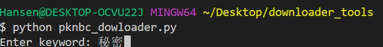

# hanman_downloader
1. python3 pknbc_downloader.py 

2. set the keyword an example would be "秘密"
3. move combine.py in to the directories with folders

4. combine jpgs into one whold pdf: python2 combine.py
